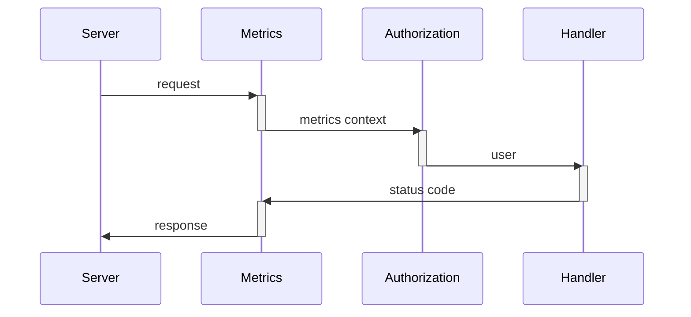

# Middlewares

## Authorization
Almost every application needs some authorization and authentication mechanism. 
To be compliant with DRY and to avoid boilerplate code, most frameworks use middleware for such stuff.
gNext also allows you to write middlewares in.

Let's take a simple user model in `users.go` file:

``` go title="users.go"
type User struct {
    Id    int    `json:"id"`
    Name  string `json:"name"`
    Age   int    `json:"age"`
    Token string `json:"-"`
}
```

And a list of user:

``` go title="users.go"
var users = []*User{
    {
        Id:    0,
        Name:  "Krzesimir",
        Age:   34,
        Token: "token-1",
    },
    {
        Id:    1,
        Name:  "Ziemowit",
        Age:   42,
        Token: "token-2",
    },
}
```

!!! warning "Security alert"
    For simplicity, we use a plain text tokens in this example. Normally user authorization should be secured using e.g. [JWT](https://github.com/golang-jwt/jwt).

Let's say, that everyone who is authorized can see information about any other user (file: `example.go`).

``` go title="example.go"
func handler(userId int) (*User, gnext.Status) {
	for _, usr := range users {
		if usr.Id == userId {
			return usr, http.StatusOK
		}
	}
	return nil, http.StatusNotFound
}

func main() {
	r := gnext.Router()

	r.GET("/users/:id/", handler)
	_ = r.Run("", "8080")
}
```

After running it, you can try it out directly from the docs. But now, everyone can see any user without authorization.
Let's define a middleware then.

Middleware is a function which looks very similarly to handler. 
It can be executed before or after handler and have input and output parameters. 
As input parameters you can use the same request data as in handler. Output parameters can be used in next middlewares and handler.

So let's create an authorization middleware, which will check a token provided in `Authorization` header. 
If token doesn't exist nor belong to some user, we want to stop the flow, not running handler.  

``` go title="middleware.go"
import (
	"fmt"
	"github.com/meteran/gnext"
)

type AuthorizationHeaders struct {
	gnext.Headers
	Authorization string `header:"Authorization"`
}

func authorizationMiddleware(headers *AuthorizationHeaders) (*User, error) {
	for _, usr := range users {
		if usr.Token == headers.Authorization {
			return usr, nil
		}
	}
	return nil, fmt.Errorf("unauthorized")
}
```

And use this middleware before we set up a handler:

``` go title="example.go"
func main() {
	r := gnext.Router()

	r.Use(gnext.Middleware{
		Before: authorizationMiddleware,
	})

	r.GET("/users/:id/", handler)
	_ = r.Run("", "8080")
}
```

Now only authorized users can access the data. The rest will get an unhandled error - 500.
Any values with custom types returned from the middleware can be passed to a next middleware or a handler as an input parameter.
Knowing that, we can modify our handler to take a current user (recognized by a token) as a handler parameter:

``` go title="example.go"
func handler(userId int, actor *User) (*User, gnext.Status) {
    log.Printf("actor: %v", actor)
    for _, usr := range users {
        if usr.Id == userId {
            return usr, http.StatusOK
        }
    }
    return nil, http.StatusNotFound
}
```

gNext has mapped the user object by type `*User`. 
It recognized, that a middleware has output parameter `*User` and handler has an input parameter of the same type, and it called handler with `*User` value.
If you want to catch the returned error, you should read about [error handling](../error-handling/) in gNext.

## Metrics and monitoring

Now we would like to monitor our server logging two things - how much time the endpoint execution took and what status code was returned.
We will start from status code. Let's create a new file `metrics.go` and log the returned status code.

``` go title="metrics.go"
func metricsAfterMiddleware(status gnext.Status) {
	log.Printf("status: %d", status)
}
```

Register it in router:

``` go title="example.go"
func main() {
	r := gnext.Router()

	r.Use(gnext.Middleware{
		After:  metricsAfterMiddleware,
	})

	r.Use(gnext.Middleware{
		Before: authorizationMiddleware,
	})

	r.GET("/users/:id/", handler)
	_ = r.Run("", "8080")
}
```

If we make a call to our endpoint, the metrics middleware will be executed after the handler, and will get the HTTP status code which is supposed to be returned.

!!! note "Note" 
    Metrics middleware is registered before the authorization one. This will be important later.

That was quite easy, because we implemented stateless middleware. 
To calculate how much time the request took, we need to forward the start time from one middleware to another.
As I mentioned in the section above, we can return value of any custom type from middleware, and if handler or another middleware takes it as an argument, it will be forwarded.
So let's create out context type to pass it between middlewares:

``` go title="metrics.go"
type metricsContext struct {
    startedAt time.Time
}
```

Create a new middleware to make a context and modify our current middleware to use it.

``` go title="metrics.go"
func metricsBeforeMiddleware() *metricsContext {
    return &metricsContext{time.Now()}
}

func metricsAfterMiddleware(ctx *metricsContext, status gnext.Status) {
    log.Printf("execution time: %v, status: %d", time.Now().Sub(ctx.startedAt), status)
}
```

The value of type `*metricsContext` is created and returned from `metricsBeforeMiddleware`.
`metricsAfterMiddleware` takes value of the same type, so gNext calls it with the value returned from `metricsBeforeMiddleware`.

!!! danger "Important"
    Pointer to some type is not the same as that type (`*A != A`). If one middleware returns `*A` and another one gets `A`, 
    the second middleware/handler will get a new zero value of `A` instead of the value returned from the first middleware.
    In this case it will be a context with zero time value, and the execution time will be calculated incorrectly (counted in years).
    Unfortunately there is no error in case the middleware/handler takes a not existing value.
    The zero value is being created in order to allow fallback execution after error handling.
    Be sure, you have exactly the same type in all middlewares/handler which uses the same value.
    

And register new middleware to the router:

```go title="example.go"
func main() {
	r := gnext.Router()

	r.Use(gnext.Middleware{
		Before: metricsBeforeMiddleware,
		After:  metricsAfterMiddleware,
	})

	r.Use(gnext.Middleware{
		Before: authorizationMiddleware,
	})

	r.GET("/users/:id/", handler)
	_ = r.Run("", "8080")
}
```

Now we can see why the registration order is important. 
`metricsBeforeMiddleware` will save the start time before `authorizationMiddleware` execution.
If we change the registration order, the start time would be checked after `authorizationMiddleware`, and its execution time would be excluded.

So how does the execution chain look like now:



!!! tip "Remember"
    The order of middleware registration determines the order of their execution. 

